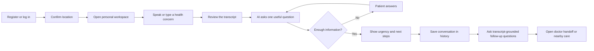
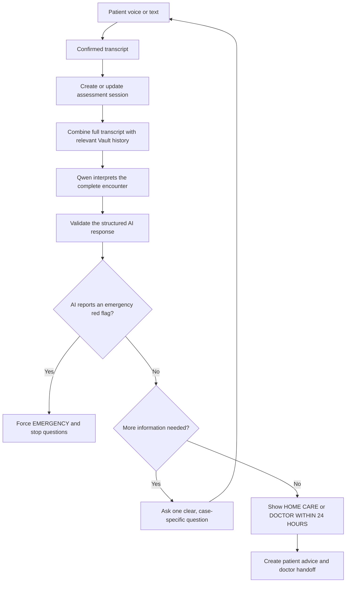
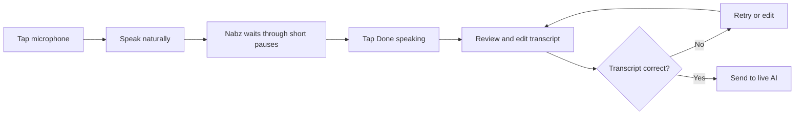
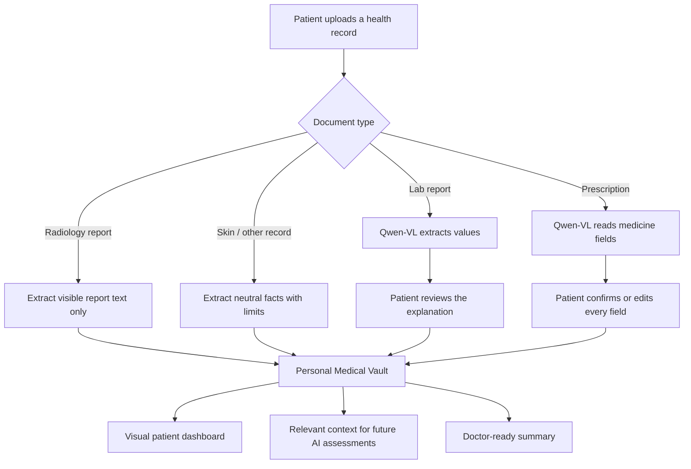
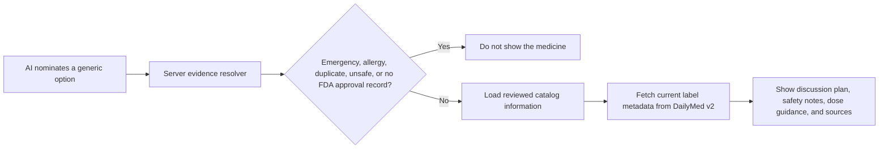
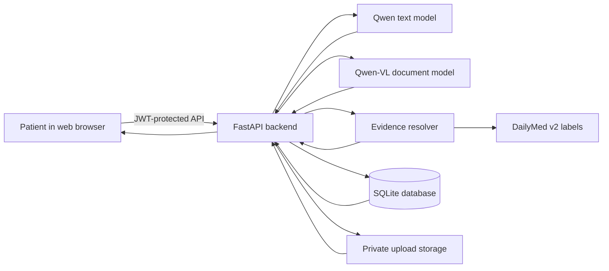

# Nabz — نبض

> **آپ کی آواز، آپ کی صحت** · Your voice, your health

Nabz is an Urdu-first AI health assistant built for the **Alibaba Cloud AI Hackathon Pakistan 2026**. A patient can describe a concern by voice or text, answer clear follow-up questions, receive an urgency recommendation, and prepare a useful summary for a doctor.

Nabz is a web application. Its desktop workspace keeps three things visible together:

1. previous health conversations;
2. the current AI assessment;
3. the patient's Medical Vault and health timeline.

> **Medical safety:** Nabz does not replace a doctor, confirm a diagnosis, or independently prescribe medicine. In an emergency, contact emergency services or go to a hospital immediately.

---

## Feature overview

Twelve capabilities, all backed by validated model output and server-side safety:

| # | Feature | Where |
| --- | --- | --- |
| 1 | **Voice-first triage** — Urdu / Roman Urdu / English, cloud STT + browser fallback | `voice_stt.py`, `triage.py` |
| 2 | **Symptom-photo triage** — one AI-requested clinical image → structured VL observations feed the transcript | `sessions.py`, `vision.py` |
| 3 | **Family Vault** — one account, separate profiles per family member with private history | `profiles.py`, `documents.py` |
| 4 | **Lab report explainer** — Qwen-VL extracts flagged values with plain-Urdu explanation | `labreport.py` |
| 5 | **Prescription scan + confirm** — model drafts, patient confirms every field before Vault write | `prescription.py` |
| 6 | **Doctor QR handoff** — 2 h JWT-signed public snapshot; scan → SBAR report in 30 s | `handoff.py`, `HandoffPage.jsx` |
| 7 | **Nearby care** — curated PK facilities (hospitals + pharmacies + blood banks) ranked by distance | `facilities.py`, `clinics.py` |
| 8 | **PK-context differential ranking** — season × province weighted (dengue July-Nov, malaria south) | `pk_context.py` |
| 9 | **Cross-session memory** — recent triage summaries injected into next assessment prompt | `sessions.py`, `triage.py` |
| 10 | **Medication safety** — WHO/FDA-catalog only, allergy/pregnancy/duplicate filter, live DailyMed labels | `medicine_evidence.py`, `dailymed.py` |
| 11 | **Treatment-class suggestions** — model-generated OTC drug classes with pharmacist-verify note | `triage.py`, `TriageResult.jsx` |
| 12 | **Emergency escalation** — deterministic red-flag detector routes to Rescue 1122 + nearest ER | `triage.py:_mental_health_turn` |

Plus: **live safety-eval dashboard** (`/api/health/safety` — 26 adversarial cases every request), **guest mode** (JWT-scoped anonymous session, 3-follow-up cap), **per-user USD budget ledger** with Qwen → OpenAI failover, and an **owner-only admin dashboard** (`/admin`) with per-user AI cost tracking.

---

## Current experience

After login, the user sees only the health record linked to their own account. There is no patient-switch control in the main workspace.

| Left side | Center | Right side |
| --- | --- | --- |
| Past conversations, clear titles, dates, and urgency | Voice/text conversation and AI assessment | Vault documents, medicines, allergies, conditions, labs, and activity |

The conversation list works like a chat history. Qwen creates a short descriptive title such as **“Right arm red mark assessment.”** Selecting an old conversation opens its result and transcript. The patient can then ask follow-up questions grounded in that transcript and the current Vault summary without changing the saved urgency result. Selecting **New health conversation** starts a clean assessment.

### Main user flow



---

## How the AI assessment works

Nabz does not choose questions from a fixed complaint question list. The live Qwen model reads the complete conversation and the relevant patient Vault context before every turn.

It then does one of two things:

- asks the single most useful next question; or
- ends the interview and returns an urgency result.

Questions can change between encounters because they are generated from the actual words, answers, known history, and remaining uncertainty. The server limits the interview to five follow-up questions so it cannot continue indefinitely.

For a visible problem, the AI may request one optional photo when visual observations would materially improve the assessment. It does not request photos for every complaint, never requires one, and continues normally when the patient skips it. The photo is observed by Qwen-VL for that encounter and is not automatically added to the Medical Vault.



### What the model considers

- the patient's exact symptom description;
- every previous question and answer in that session;
- age, gender, conditions, allergies, and confirmed medicines;
- relevant prior assessments, labs, and Vault history;
- reported warning signs, denied warning signs, and facts that are still unknown.

Vault history is context, not proof. For example, a previous migraine does not mean a new headache is automatically another migraine.

### Urgency levels

| Result | Meaning |
| --- | --- |
| 🚑 **EMERGENCY** | Seek emergency help now |
| 🩺 **DOCTOR_24H** | See a clinician within 24 hours |
| 🏠 **HOME_CARE** | Home care with monitoring and clear escalation signs |

If the AI service is unavailable, Nabz clearly labels the response **AI assessment unavailable**. It does not pretend that a generic safety message is a clinical interpretation. The workspace also shows whether live AI is connected.

---

## Voice flow

The patient can speak in Urdu or English when supported by the browser, and can type in Urdu, Roman Urdu, or English.



- The first voice message uses a longer silence window.
- Follow-up answers also allow time for natural pauses.
- Nothing is sent until the patient confirms the transcript.
- Typed input and quick replies remain available.
- Nabz stops its own spoken reply before listening, so it does not record itself.
- The top bar has a **Stop audio** control that stops the reader from any page.

---

## Medical Vault and doctor handoff

The personal Vault can store:

- lab reports;
- confirmed prescriptions;
- X-rays and MRI/scan files;
- skin or progress photos;
- conditions and allergies;
- confirmed current medicines;
- past AI assessment sessions and results.

The dashboard turns these records into document counts, visual bars, recent activity, health-history cards, and a timeline. The latest assessment is also available in a doctor-focused view.



Prescription extraction is document reading, not prescribing. Extracted medicines are not saved until the patient confirms them.

Other Vault uploads can provide structured supportive context for later live conversations. X-ray and MRI uploads use only visible report text—the model does not interpret radiology pixels. Skin photos produce neutral visible observations, not a diagnosis. If extraction is unavailable or unreliable, Nabz keeps the original and labels the extraction status instead of fabricating content.

### Medicine information and evidence

The AI may nominate a generic medicine for the server to check. It cannot directly create a medicine card, dose, citation, evidence link, or prescription. Nabz builds a proposed **medication discussion plan** from the unconfirmed clinical impression—not from a claimed diagnosis.



The server:

- blocks medicine information during emergencies;
- checks the patient's recorded allergies and current medicines;
- blocks prescription-only and high-risk self-treatment options;
- discards model-written doses and URLs;
- uses only reviewed catalog doses and allowlisted sources;
- emits a medication option only when a reviewed Drugs@FDA application record verifies that an FDA-approved product exists for the active ingredient;
- queries the official DailyMed v2 service using only the allowlisted generic name and links the selected current Structured Product Label;
- displays the FDA application number and source, while warning that U.S. FDA status does not replace Pakistani product registration or pharmacist review;
- labels the complete plan as discussion-only, includes non-drug care, monitoring/escalation signs, and pharmacist/clinician follow-up, and never presents it as a prescription.

Possible causes are shown with qualitative labels such as **More likely**, **Possible**, and **Less likely**, followed by a simple explanation and what would help a clinician confirm the cause. Nabz does not display invented disease percentages from a chat or photo.

---

## Simple system architecture



The DashScope API key and JWT secret stay on the backend. They are never sent to the browser.

### Tech stack

**Frontend — Progressive Web App**

| Layer | Choice | Why |
| --- | --- | --- |
| Framework | **React 18** + **Vite 5** | Fast HMR, small production bundle (~140 KB gz) |
| Routing | **React Router v6** | Client-side navigation, deep-linkable handoff pages |
| State | Context + hooks (no Redux) | Small app, clear ownership per feature |
| Voice input | Cloud STT via `MediaRecorder` → `/api/voice/transcribe` (Qwen3.5-Omni), `webkitSpeechRecognition` fallback | Real Urdu accuracy Chrome can't match |
| Voice output | Server-side gTTS (`/api/tts`) with `SpeechSynthesis` fallback | Actual Urdu pronunciation |
| QR generation | `qrcode` npm package (client-side SVG) | Zero-cost doctor handoff QRs |
| Styling | Plain CSS + custom design tokens (`--radius-*`, `--shadow-*`, `--focus-ring`) | Full control, no runtime cost |
| PWA | Manifest + service worker + PNG icons + apple-touch-icon | Installable on Android/iOS home screen |
| Mobile shell | **Capacitor** scaffold (Android APK build) | Same web codebase → native wrapper |

**Backend — FastAPI service**

| Layer | Choice | Why |
| --- | --- | --- |
| Framework | **FastAPI** + **Pydantic v2** | Async, strict schema validation everywhere |
| ORM | **SQLAlchemy 2.0** | Typed models, transactional guardrails |
| Database | **SQLite** (dev + single-VM prod) → managed SQL for multi-replica | Zero-config for hackathon, upgradable |
| Object storage | **Local disk** (dev) / **S3-compatible** (`NABZ_STORAGE_BACKEND=s3`) | Vault documents, triage images |
| Auth | **JWT** (HS256, `python-jose`) + **bcrypt** (passlib) | Two token kinds: `account` and `handoff` |
| Streaming | Server-Sent Events for triage progress (`/api/triage/stream/*`) | Live typing progress in the browser |
| PDF handling | **PyMuPDF** (lab reports + prescriptions rendered to PNG) | Robust text + image extraction |

**AI providers — provider-agnostic OpenAI-compatible client**

| Role | Primary | Fallback | Fired when |
| --- | --- | --- | --- |
| Text triage | **Alibaba Qwen3.7-plus** (DashScope) | **OpenAI `gpt-4o`** | Quota, auth, rate-limit, timeout, or unrepairable JSON |
| Image analysis | **Qwen-VL** | **OpenAI `gpt-4o` vision** | Same triggers |
| Audio STT | **Qwen3.5-Omni** | (browser `webkitSpeechRecognition`) | Server unavailable |
| TTS | Server gTTS | Browser `SpeechSynthesis` | gTTS unreachable |

- Fallback is **automatic and audited** — every call is logged with `provider`, `model`, `tokens`, `cost_microusd`, `fallback_reason` in the Admin ledger. Never fabricates a response.
- **Per-user USD cap** — registered account $1.00, guest session $0.30 (env-overridable). Reservation → provider call → reconcile. Concurrent-safe via atomic `UPDATE ... WHERE used + reserved + amount <= limit`. Cap exhaustion returns `AIBudgetExceeded` before any provider is called.
- **JWT-scoped guest sessions** — anonymous MediaRecorder + Qwen with 2 h TTL and 3-followup limit.

**Clinical safety layers (backend)**

| Layer | Purpose |
| --- | --- |
| `_IMMEDIATE_MENTAL_HEALTH_PATTERNS` + `_mental_health_turn` | Deterministic escalation on suicidal / self-harm keywords (Urdu + Roman Urdu + English) → EMERGENCY with Rescue 1122 + Umang helpline, no medication |
| Emergency red-flag validator | Model-declared red flags force EMERGENCY + strip medication |
| `resolve_medication_candidates` | Only WHO/FDA-catalog `(condition_key, generic_name)` pairs pass; DailyMed v2 label linked live |
| Allergy + duplicate + pregnancy filter | Server-side, before any medication reaches the UI |
| `treatment_class_suggestions` | Model-generated OTC **classes** (not brand, not dose, not prescription-only) with pharmacist-verify caption |
| PK-context differential ranker | Season × province weighted (dengue Jul-Nov Punjab/Sindh, malaria Sindh/Balochistan, TB, typhoid monsoon) |
| Doctor QR handoff | Short-lived (2 h) HS256 JWT with `kind: "handoff"` — public read, no auth needed. Bounded snapshot only, no transcript / location / phone |
| Live safety-eval dashboard | `/api/health/safety` — 26 adversarial cases (emergency + mental-health + drug-refusal + allergy + prompt-injection + evidence URLs) run every request in ~0.5 ms |

**Ops + observability**

- Structured JSON access logs (`observability.RequestTelemetryMiddleware`) — never records bodies, transcripts, or tokens.
- Admin dashboard `/admin` (owner-only, allowlisted phones/emails) shows per-user AI spend, provider mix, fallback reasons, aggregate consent coverage.
- Health endpoints: `/api/health/live` (process), `/api/health/ready` (deps), `/api/health/detail` (dev-only), `/api/health/safety` (deterministic).
- Consent ledger — append-only versioned records for `health_data_storage` + `ai_processing`.
- Startup contract (`runtime.validate_startup_configuration`) — production **fails closed** if any of {DASHSCOPE key, DB URL, JWT secret, S3 bucket, admin identifiers} is missing.

**Infrastructure**

- **Local dev:** `uvicorn main:app --reload` + `npm run dev` (Vite on 5173).
- **Prod (single-VM):** Docker Compose (`compose.prod.yaml`) — FastAPI + SQLite volume + S3-compatible object storage. `docs/ALIBABA_CLOUD_DEPLOY.md` for ECS + HTTPS + backups.
- **Prod (managed):** Render.com — backend Web Service (Docker), frontend Static Site.
- **CI-free** — repo runs `pytest` + `npm run build` locally; both are single-command smoke gates before commit.

---

## Run locally

### Requirements

- Python 3.11 or 3.12;
- Node.js 18 or newer;
- npm;
- a DashScope API key for live AI assessment.

### 1. Install the backend

```bash
cd server
python3 -m venv venv
source venv/bin/activate
pip install -r requirements.txt
```

### 2. Configure the environment

From the repository root:

```bash
cp .env.example server/.env
```

Set at least:

```env
APP_ENV=development
DASHSCOPE_API_KEY=your-key
NABZ_TEXT_MODEL=qwen3.7-plus
NABZ_TRIAGE_TIMEOUT_SECONDS=60
NABZ_DAILYMED_LIVE=true
NABZ_DAILYMED_TIMEOUT_SECONDS=4
NABZ_VL_MODEL=qwen3.7-plus
JWT_SECRET=replace-with-a-long-random-secret
MOCK_MODE=false
NABZ_ENABLE_DEMO=false
CORS_ORIGINS=http://localhost:5173,http://localhost:5174
```

`MOCK_MODE=true` can provide synthetic lab, prescription, and demo-document data. Clinical triage still needs a working DashScope key; there is no production rule-based triage fallback.

### 3. Start the backend

```bash
cd server
source venv/bin/activate
uvicorn main:app --reload --port 8000
```

Check the live model configuration:

```bash
curl -s http://localhost:8000/api/health/detail
```

The response should include:

```json
{
  "status": "ok",
  "triage_engine": "live_ai",
  "ai_configured": true,
  "text_model": "qwen3.7-plus"
}
```

### 4. Start the web application

In another terminal:

```bash
cd client
npm install
npm run dev
```

Open `http://localhost:5173`. If that port is already being used, Vite may show the application on `http://localhost:5174`.

---

## Important API routes

All personal health routes require a valid login token.

| Method | Route | Purpose |
| --- | --- | --- |
| `POST` | `/api/auth/register` | Create an account and personal profile |
| `POST` | `/api/auth/login` | Log in |
| `GET` | `/api/auth/me` | Read the signed-in account |
| `POST` | `/api/triage/start` | Start a live AI health conversation |
| `POST` | `/api/triage/answer` | Send one answer and receive the next turn |
| `POST` | `/api/triage/chat` | Ask a follow-up grounded in one saved transcript and current Vault |
| `POST` | `/api/triage/image` | Analyze one optional AI-requested clinical photo |
| `POST` | `/api/triage/retry/{session_id}` | Retry a timed-out AI turn without losing the transcript |
| `GET` | `/api/triage/history?profile_id={id}` | List titled and dated conversations |
| `GET` | `/api/triage/history/{session_id}` | Open one result and full transcript |
| `GET` | `/api/dashboard/{profile_id}` | Load the Vault-based visual dashboard |
| `GET` | `/api/documents?profile_id={id}` | List personal Vault files |
| `POST` | `/api/documents` | Upload a Vault document |
| `POST` | `/api/labreport` | Extract and explain a lab report |
| `POST` | `/api/prescription` | Read a prescription for confirmation |
| `POST` | `/api/prescription/confirm` | Save patient-confirmed prescription data |
| `GET` | `/api/summary/{profile_id}` | Create the doctor handoff |
| `POST` | `/api/summary/{profile_id}/handoff` | Mint a short-lived (2h) doctor-QR JWT + URL |
| `GET` | `/api/handoff/{token}` | Public bounded read of the handoff snapshot (no auth) |
| `GET` | `/api/facilities/nearby` | Find care appropriate to the urgency |
| `POST` | `/api/voice/transcribe` | Cloud Urdu STT via Qwen3.5-Omni |
| `GET` | `/api/tts?text=…&lang=ur` | Server-rendered Urdu TTS (gTTS) |
| `POST` | `/api/guest/triage/start` | Anonymous JWT-scoped guest triage (2 h TTL) |
| `POST` | `/api/guest/triage/answer` | Guest answer turn |
| `POST` | `/api/guest/triage/chat` | Guest follow-up chat (capped at 3) |
| `GET` | `/api/health/detail` | Show backend and AI readiness |
| `GET` | `/api/health/live` | Process liveness probe |
| `GET` | `/api/health/ready` | Configuration, database, storage, and AI readiness |
| `GET` | `/api/health/safety` | 26-case deterministic safety-eval report |
| `GET` | `/api/admin/overview` | Owner dashboard: users, AI cost ledger, consent coverage |

---

## Tests

Backend tests use a test-only injected AI provider. They do not use a hidden production rules engine and do not spend DashScope credits.

```bash
cd server
MOCK_MODE=true venv/bin/python -m pytest tests/ -q
```

Current expected result:

```text
110 passed
```

Build the web application:

```bash
cd client
npm run build
```

Run the scripted safety evaluation:

```bash
python eval.py
```

Run the optional live-model variation check:

```bash
server/venv/bin/python scripts/live_triage_eval.py
```

The live evaluation is skipped when `DASHSCOPE_API_KEY` is missing and is capped to avoid unlimited model calls.

See [TESTING.md](TESTING.md) for more test and demo checks.

---

## Production deployment

The production stack is fail-closed: mock mode, demo APIs, and API documentation
are disabled; a real AI key, explicit database URL, strong signing secret, and
private S3/R2 storage are required before the API accepts traffic.

```bash
cp .env.production.example .env.production
# Replace every placeholder and configure the private bucket first.
server/venv/bin/python scripts/check_production_config.py .env.production
docker compose --env-file .env.production -f compose.prod.yaml up -d --build
server/venv/bin/python scripts/production_smoke.py http://127.0.0.1
```

The private product dashboard is available at `/admin`. Set
`NABZ_ADMIN_IDENTIFIERS` on the backend to the exact email or phone of the
owner account (comma-separated values are supported). The server re-checks
this allowlist for every dashboard API request. Usage tracking records active
seconds, page routes, status codes and latency; it never stores request bodies,
chat text, tokens or uploaded content in analytics logs.

On Render, add `NABZ_ADMIN_IDENTIFIERS` to the **backend Web Service**, then
redeploy that service. Do not add it to the frontend Static Site: non-`VITE_`
variables are unavailable to the built browser app, and admin authorization is
intentionally decided only by the API. The Static Site needs only
`VITE_API_BASE` pointing to the public backend URL.

Nabz stores append-only, versioned choices for health-data storage and AI
processing. New registrations accept them during profile completion; existing
accounts see a one-time privacy gate. Users can review or withdraw consent and
see their own privacy-safe activity under **Privacy**. Withdrawal blocks new
clinical writes and AI processing while preserving access to existing records
and deletion controls. The owner dashboard shows aggregate consent coverage
and event counts, never clinical event contents.

Follow [docs/ALIBABA_CLOUD_DEPLOY.md](docs/ALIBABA_CLOUD_DEPLOY.md) for the Alibaba Cloud ECS setup, HTTPS, backups, and rollback steps.

---

## Repository guide

```text
client/
  src/pages/HomePage.jsx              desktop patient workspace
  src/components/EncounterSidebar.jsx conversation history
  src/components/TriageConversation.jsx voice and interview flow
  src/components/EncounterChat.jsx        transcript-grounded follow-up chat
  src/components/PatientDashboard.jsx Vault visual dashboard
  src/components/TriageResult.jsx      urgency, suggestions, evidence, handoff

server/
  main.py                    FastAPI app and health status
  sessions.py                assessment sessions and conversation history
  triage.py                  live Qwen prompt, parsing, and safety validation
  medicine_evidence.py       reviewed medicine evidence resolver
  dailymed.py                cached official DailyMed v2 label client
  dashboard.py               personal Vault dashboard data
  documents.py               authenticated file storage
  labreport.py               lab extraction and explanation
  prescription.py            prescription extraction and confirmation
  summary.py                 doctor-ready summary
  tests/                     API, safety, isolation, and orchestration tests

scripts/live_triage_eval.py  optional real-Qwen evaluation
compose.prod.yaml            production containers
TESTING.md                   testing guide
PRIVACY.md                   privacy statement
```

---

## Privacy and safety boundaries

- Each signed-in user sees their own personal workspace.
- Every profile, session, dashboard, document, and summary request is checked against account ownership.
- Original Vault files require authentication to open.
- API keys stay on the server.
- The patient reviews voice transcripts before sending.
- The patient confirms prescription extraction before saving.
- Unknown clinical facts remain unknown; Nabz does not silently turn them into negative findings.
- AI output is parsed and validated before it reaches the UI.
- A real clinical deployment would still require formal security, privacy, regulatory, and clinical-safety review.

Read [PRIVACY.md](PRIVACY.md) for the complete privacy statement.

---

## Short hackathon demo

1. Log in as Kheem and show the three-column web workspace.
2. Point to Kheem's previous conversations and Vault dashboard.
3. Start a new conversation and say: `mere right bazu pe surkh nishan hai`.
4. Review the voice transcript before sending it.
5. Show that Qwen asks a case-specific question and creates a useful session title.
6. Complete the conversation and show urgency, practical suggestions, and any evidence-checked medicine information.
7. Open the saved conversation from the left sidebar.
8. Open the doctor handoff and show which Vault facts were used.

---

## Medical disclaimer

**یہ ڈاکٹر کا متبادل نہیں ہے۔**

Nabz is not a substitute for a doctor or emergency service. It does not provide a confirmed diagnosis or independently prescribe medication. Medicine cards are reviewed information that may be discussed with a doctor or pharmacist.

If there is severe difficulty breathing, chest pain, unconsciousness, major bleeding, seizures, stroke symptoms, poisoning, serious injury, severe pregnancy-related symptoms, suicidal thoughts, or another emergency concern, seek emergency medical help immediately.

---

**Nabz — نبض**  
_آپ کی آواز، آپ کی صحت · Your voice, your health_  
Built for the **Alibaba Cloud AI Hackathon Pakistan 2026**.
