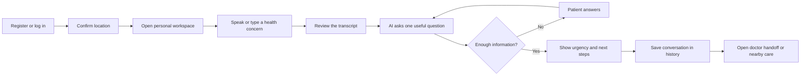
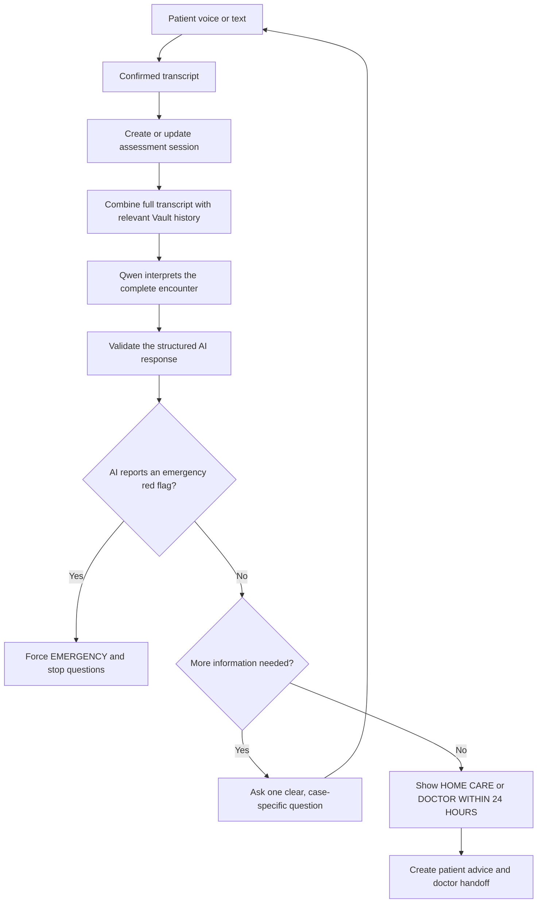
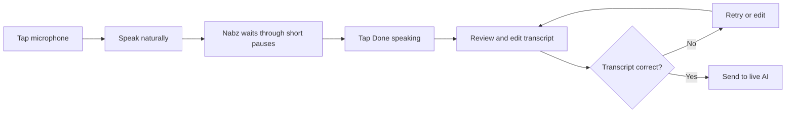
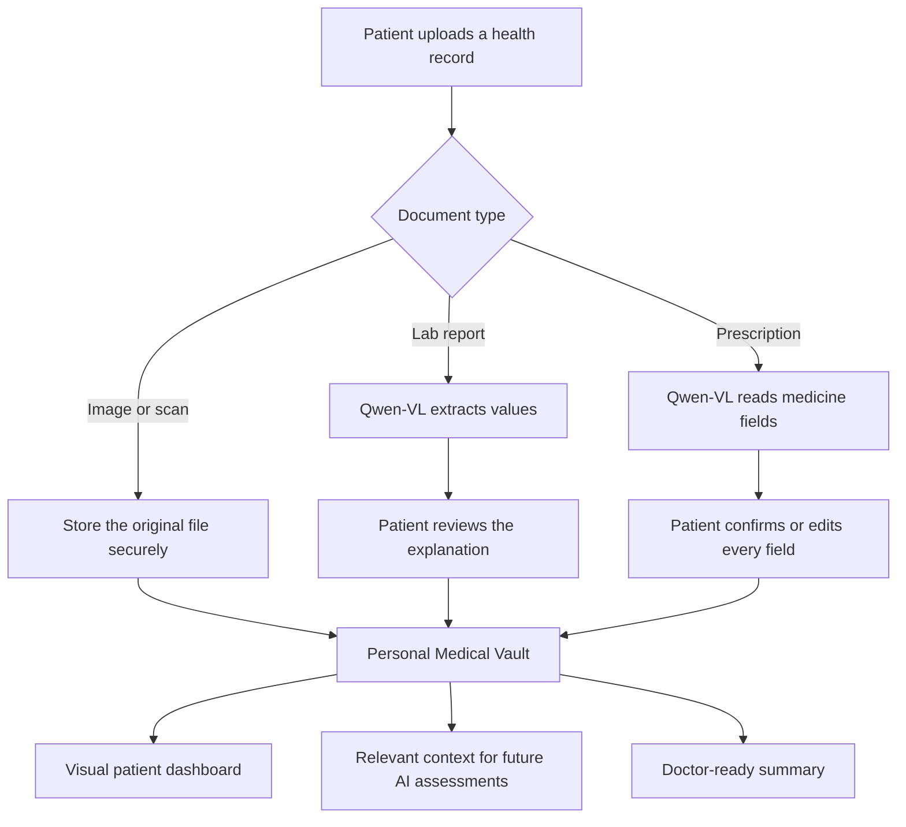
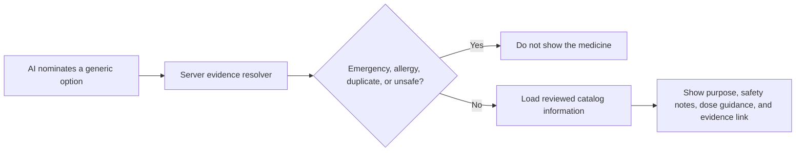
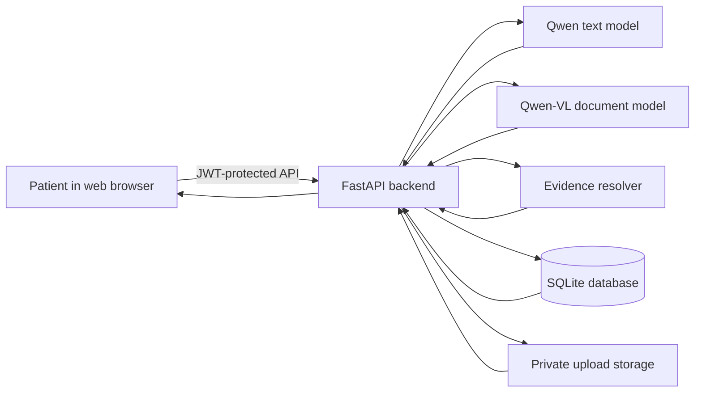

# Nabz — نبض

> **آپ کی آواز، آپ کی صحت** · Your voice, your health

Nabz is an Urdu-first AI health assistant built for the **Alibaba Cloud AI Hackathon Pakistan 2026**. A patient can describe a concern by voice or text, answer clear follow-up questions, receive an urgency recommendation, and prepare a useful summary for a doctor.

Nabz is a web application. Its desktop workspace keeps three things visible together:

1. previous health conversations;
2. the current AI assessment;
3. the patient's Medical Vault and health timeline.

> **Medical safety:** Nabz does not replace a doctor, confirm a diagnosis, or independently prescribe medicine. In an emergency, contact emergency services or go to a hospital immediately.

---

## Current experience

After login, the user sees only the health record linked to their own account. There is no patient-switch control in the main workspace.

| Left side | Center | Right side |
| --- | --- | --- |
| Past conversations, clear titles, dates, and urgency | Voice/text conversation and AI assessment | Vault documents, medicines, allergies, conditions, labs, and activity |

The conversation list works like a chat history. Qwen creates a short descriptive title such as **“Right arm red mark assessment.”** Selecting an old conversation opens its result and transcript. Selecting **New health conversation** starts a clean assessment.

### Main user flow



---

## How the AI assessment works

Nabz does not choose questions from a fixed complaint question list. The live Qwen model reads the complete conversation and the relevant patient Vault context before every turn.

It then does one of two things:

- asks the single most useful next question; or
- ends the interview and returns an urgency result.

Questions can change between encounters because they are generated from the actual words, answers, known history, and remaining uncertainty. The server limits the interview to five follow-up questions so it cannot continue indefinitely.



### What the model considers

- the patient's exact symptom description;
- every previous question and answer in that session;
- age, gender, conditions, allergies, and confirmed medicines;
- relevant prior assessments, labs, and Vault history;
- reported warning signs, denied warning signs, and facts that are still unknown.

Vault history is context, not proof. For example, a previous migraine does not mean a new headache is automatically another migraine.

### Urgency levels

| Result | Meaning |
| --- | --- |
| 🚑 **EMERGENCY** | Seek emergency help now |
| 🩺 **DOCTOR_24H** | See a clinician within 24 hours |
| 🏠 **HOME_CARE** | Home care with monitoring and clear escalation signs |

If the AI service is unavailable, Nabz clearly labels the response **AI assessment unavailable**. It does not pretend that a generic safety message is a clinical interpretation. The workspace also shows whether live AI is connected.

---

## Voice flow

The patient can speak in Urdu or English when supported by the browser, and can type in Urdu, Roman Urdu, or English.



- The first voice message uses a longer silence window.
- Follow-up answers also allow time for natural pauses.
- Nothing is sent until the patient confirms the transcript.
- Typed input and quick replies remain available.
- Nabz stops its own spoken reply before listening, so it does not record itself.
- The top bar has a **Stop audio** control that stops the reader from any page.

---

## Medical Vault and doctor handoff

The personal Vault can store:

- lab reports;
- confirmed prescriptions;
- X-rays and MRI/scan files;
- skin or progress photos;
- conditions and allergies;
- confirmed current medicines;
- past AI assessment sessions and results.

The dashboard turns these records into document counts, visual bars, recent activity, health-history cards, and a timeline. The latest assessment is also available in a doctor-focused view.



Prescription extraction is document reading, not prescribing. Extracted medicines are not saved until the patient confirms them.

### Medicine information and evidence

The AI may nominate a generic medicine for the server to check. It cannot directly create a medicine card, dose, citation, or evidence link.



The server:

- blocks medicine information during emergencies;
- checks the patient's recorded allergies and current medicines;
- blocks prescription-only and high-risk self-treatment options;
- discards model-written doses and URLs;
- uses only reviewed catalog doses and allowlisted sources;
- describes medicine cards as information to discuss, not a prescription.

---

## Simple system architecture



The DashScope API key and JWT secret stay on the backend. They are never sent to the browser.

### Main technology

- React 18 and Vite;
- FastAPI and Pydantic;
- SQLAlchemy and SQLite for the hackathon build;
- Alibaba Cloud Model Studio / DashScope;
- `qwen3.7-plus` for live conversational assessment;
- Qwen-VL for lab and prescription extraction;
- browser speech recognition and speech synthesis;
- JWT authentication.

---

## Run locally

### Requirements

- Python 3.11 or 3.12;
- Node.js 18 or newer;
- npm;
- a DashScope API key for live AI assessment.

### 1. Install the backend

```bash
cd server
python3 -m venv venv
source venv/bin/activate
pip install -r requirements.txt
```

### 2. Configure the environment

From the repository root:

```bash
cp .env.example server/.env
```

Set at least:

```env
DASHSCOPE_API_KEY=your-key
NABZ_TEXT_MODEL=qwen3.7-plus
NABZ_TRIAGE_TIMEOUT_SECONDS=60
NABZ_VL_MODEL=qwen3.7-plus
JWT_SECRET=replace-with-a-long-random-secret
MOCK_MODE=false
CORS_ORIGINS=http://localhost:5173,http://localhost:5174
```

`MOCK_MODE=true` can provide synthetic lab, prescription, and demo-document data. Clinical triage still needs a working DashScope key; there is no production rule-based triage fallback.

### 3. Start the backend

```bash
cd server
source venv/bin/activate
uvicorn main:app --reload --port 8000
```

Check the live model configuration:

```bash
curl -s http://localhost:8000/api/health/detail
```

The response should include:

```json
{
  "status": "ok",
  "triage_engine": "live_ai",
  "ai_configured": true,
  "text_model": "qwen3.7-plus"
}
```

### 4. Start the web application

In another terminal:

```bash
cd client
npm install
npm run dev
```

Open `http://localhost:5173`. If that port is already being used, Vite may show the application on `http://localhost:5174`.

---

## Important API routes

All personal health routes require a valid login token.

| Method | Route | Purpose |
| --- | --- | --- |
| `POST` | `/api/auth/register` | Create an account and personal profile |
| `POST` | `/api/auth/login` | Log in |
| `GET` | `/api/auth/me` | Read the signed-in account |
| `POST` | `/api/triage/start` | Start a live AI health conversation |
| `POST` | `/api/triage/answer` | Send one answer and receive the next turn |
| `POST` | `/api/triage/retry/{session_id}` | Retry a timed-out AI turn without losing the transcript |
| `GET` | `/api/triage/history?profile_id={id}` | List titled and dated conversations |
| `GET` | `/api/triage/history/{session_id}` | Open one result and full transcript |
| `GET` | `/api/dashboard/{profile_id}` | Load the Vault-based visual dashboard |
| `GET` | `/api/documents?profile_id={id}` | List personal Vault files |
| `POST` | `/api/documents` | Upload a Vault document |
| `POST` | `/api/labreport` | Extract and explain a lab report |
| `POST` | `/api/prescription` | Read a prescription for confirmation |
| `POST` | `/api/prescription/confirm` | Save patient-confirmed prescription data |
| `GET` | `/api/summary/{profile_id}` | Create the doctor handoff |
| `GET` | `/api/facilities/nearby` | Find care appropriate to the urgency |
| `GET` | `/api/health/detail` | Show backend and AI readiness |

---

## Tests

Backend tests use a test-only injected AI provider. They do not use a hidden production rules engine and do not spend DashScope credits.

```bash
cd server
MOCK_MODE=true venv/bin/python -m pytest tests/ -q
```

Current expected result:

```text
52 passed
```

Build the web application:

```bash
cd client
npm run build
```

Run the scripted safety evaluation:

```bash
python eval.py
```

Run the optional live-model variation check:

```bash
server/venv/bin/python scripts/live_triage_eval.py
```

The live evaluation is skipped when `DASHSCOPE_API_KEY` is missing and is capped to avoid unlimited model calls.

See [TESTING.md](TESTING.md) for more test and demo checks.

---

## Production deployment

The repository includes Docker images, an Nginx same-origin API proxy, health checks, and persistent storage configuration.

```bash
docker compose --env-file .env.production -f compose.prod.yaml up -d --build
```

Follow [docs/ALIBABA_CLOUD_DEPLOY.md](docs/ALIBABA_CLOUD_DEPLOY.md) for the Alibaba Cloud ECS setup, HTTPS, backups, and rollback steps.

---

## Repository guide

```text
client/
  src/pages/HomePage.jsx              desktop patient workspace
  src/components/EncounterSidebar.jsx conversation history
  src/components/TriageConversation.jsx voice and interview flow
  src/components/PatientDashboard.jsx Vault visual dashboard
  src/components/TriageResult.jsx      urgency, suggestions, evidence, handoff

server/
  main.py                    FastAPI app and health status
  sessions.py                assessment sessions and conversation history
  triage.py                  live Qwen prompt, parsing, and safety validation
  medicine_evidence.py       reviewed medicine evidence resolver
  dashboard.py               personal Vault dashboard data
  documents.py               authenticated file storage
  labreport.py               lab extraction and explanation
  prescription.py            prescription extraction and confirmation
  summary.py                 doctor-ready summary
  tests/                     API, safety, isolation, and orchestration tests

scripts/live_triage_eval.py  optional real-Qwen evaluation
compose.prod.yaml            production containers
TESTING.md                   testing guide
PRIVACY.md                   privacy statement
```

---

## Privacy and safety boundaries

- Each signed-in user sees their own personal workspace.
- Every profile, session, dashboard, document, and summary request is checked against account ownership.
- Original Vault files require authentication to open.
- API keys stay on the server.
- The patient reviews voice transcripts before sending.
- The patient confirms prescription extraction before saving.
- Unknown clinical facts remain unknown; Nabz does not silently turn them into negative findings.
- AI output is parsed and validated before it reaches the UI.
- A real clinical deployment would still require formal security, privacy, regulatory, and clinical-safety review.

Read [PRIVACY.md](PRIVACY.md) for the complete privacy statement.

---

## Short hackathon demo

1. Log in as Kheem and show the three-column web workspace.
2. Point to Kheem's previous conversations and Vault dashboard.
3. Start a new conversation and say: `mere right bazu pe surkh nishan hai`.
4. Review the voice transcript before sending it.
5. Show that Qwen asks a case-specific question and creates a useful session title.
6. Complete the conversation and show urgency, practical suggestions, and any evidence-checked medicine information.
7. Open the saved conversation from the left sidebar.
8. Open the doctor handoff and show which Vault facts were used.

---

## Medical disclaimer

**یہ ڈاکٹر کا متبادل نہیں ہے۔**

Nabz is not a substitute for a doctor or emergency service. It does not provide a confirmed diagnosis or independently prescribe medication. Medicine cards are reviewed information that may be discussed with a doctor or pharmacist.

If there is severe difficulty breathing, chest pain, unconsciousness, major bleeding, seizures, stroke symptoms, poisoning, serious injury, severe pregnancy-related symptoms, suicidal thoughts, or another emergency concern, seek emergency medical help immediately.

---

**Nabz — نبض**  
_آپ کی آواز، آپ کی صحت · Your voice, your health_  
Built for the **Alibaba Cloud AI Hackathon Pakistan 2026**.
